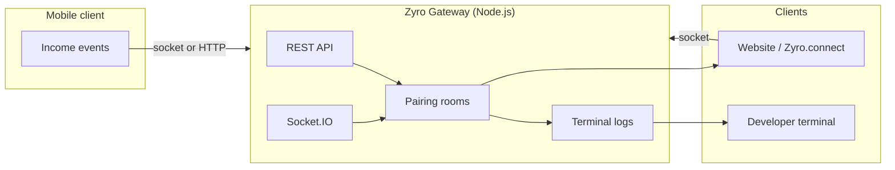

<p align="center">
  
</p>

<p align="center">
  <a href="https://www.npmjs.com/package/z-getway">
    
  </a>
  <a href="https://www.npmjs.com/package/z-getway">
    
  </a>
  <a href="https://github.com/orod-codes/zyro-getway/stargazers">
    
  </a>
</p>

<p align="center">
  <a href="https://www.npmjs.com/package/z-getway">npm</a>
  ·
  <a href="https://github.com/orod-codes/zyro-getway">Website</a>
  ·
  <a href="https://github.com/orod-codes/zyro-getway/issues">Issues</a>
</p>

## Zyro Gateway

Zyro Gateway is a framework-agnostic real-time sync layer for TypeScript and JavaScript. It moves **payment and income events** from mobile clients to **web clients and systems** over Socket.IO, with HTTP fallback when long-lived connections are unavailable. Pairing rooms, a REST surface, and a bundled browser SDK (`Zyro.connect`) ship in one npm package so you can integrate income sync without building transport, discovery, and fan-out yourself.

### Why Zyro Gateway

Reliable delivery of **transaction data** across devices on a local network is rarely a single library—it is usually custom sockets, polling endpoints, and fragile “connected” states that diverge from what the server actually sees. Zyro Gateway treats that as one problem: authenticate a pairing code, register clients, broadcast income and notifications, and expose the same events to **web and system** consumers from a small Node process—hence, Zyro Gateway.

<p align="center">
  <a href="#quick-start">Quick start</a>
  ·
  <a href="#architecture">Architecture</a>
  ·
  <a href="#configuration">Configuration</a>
  ·
  <a href="#http-api">HTTP API</a>
  ·
  <a href="#browser-client">Browser client</a>
  ·
  <a href="#troubleshooting">Troubleshooting</a>
  ·
  <a href="CHANGELOG.md">Changelog</a>
</p>

| Capability | Description |
|------------|-------------|
| Income sync | Push payment fields from mobile to gateway in real time |
| Dual transport | Socket.IO primary; HTTP register + POST when sockets drop |
| Isolated rooms | `pairingCode` scopes clients and event streams per deployment |

---

## Table of contents

- [Requirements](#requirements)
- [Installation](#installation)
- [Quick start](#quick-start)
- [Architecture](#architecture)
- [Configuration](#configuration)
- [Phone app setup](#phone-app-setup)
- [Browser client](#browser-client)
- [HTTP API](#http-api)
- [Socket.IO protocol](#socketio-protocol)
- [Programmatic server API](#programmatic-server-api)
- [CLI reference](#cli-reference)
- [Project structure](#project-structure)
- [Development](#development)
- [Publishing updates](#publishing-updates)
- [Troubleshooting](#troubleshooting)
- [Security](#security)
- [License](#license)

---

## Requirements

| Requirement | Notes |
|-------------|--------|
| **Node.js 18+** | LTS recommended |
| **Same LAN** | Phone, PC, and browser clients must reach the gateway IP |
| **Open port** | Default `3001` (configurable); only one process per port |
| **Pairing code** | 4–12 alphanumeric characters, shared across all clients |

---

## Installation

### From npm (recommended)

```bash
npm install z-getway
```

### Global CLI (optional)

```bash
npm install -g z-getway
z-getway --help
```

### From source

```bash
git clone https://github.com/orod-codes/zyro-getway.git
cd zyro-getway
npm install
npm run config
npm start
```

---

## Quick start

**1. Create config** (in your project folder—not committed to git):

```bash
npx z-getway config
```

**2. Edit `zyro.config.js`:**

```javascript
module.exports = {
  ip: '',              // auto-detect LAN IP
  port: 3001,
  pairingCode: 'MYSTORE',
  deviceName: 'My Website',
};
```

**3. Start the gateway:**

```bash
npx z-getway
```

**4. Terminal output** (example):

```text
  Zyro Gateway
  ───────────────────────
  Config    /path/to/zyro.config.js
  Pairing   MYSTORE
  App       IP 192.168.1.10   port 3001

  Connected: (waiting…)
  Income:    name · amount · sender · ref
```

**5. Phone app** → **Setup → Zyro Gateway** → enter the same **IP**, **port**, and **pairing code**.

**6. Website** → load scripts from the gateway (see [Browser client](#browser-client)).

### One-liner (no install)

```bash
npx z-getway@latest config
npx z-getway@latest
```

### Get the latest version (after you publish an update)

| How you installed | Update command |
|-------------------|----------------|
| In a project | `npm update z-getway` |
| One-off run | `npx z-getway@latest` |
| Global CLI | `npm install -g z-getway@latest` |

---

## Architecture



### Data flow

1. Phone joins room `pairing:MYSTORE` (Socket.IO) or calls `POST /api/register` + `POST /api/income` (HTTP).
2. Gateway stores transactions in memory (per pairing room), broadcasts to all web and system clients in that room.
3. Terminal prints each income: **amount**, **name**, **sender**, **reference**.
4. Web clients receive `income_transaction`, `dashboard_update`, and `presence` events.

### Transport priority

| Client | Primary | Fallback |
|--------|---------|----------|
| Phone | Socket.IO (`income_transaction`) | `POST /api/income`, `POST /api/register` |
| Website | Socket.IO + `Zyro.connect` | HTTP polling (`pollIntervalMs`) |
| Web / system probe | `GET /api/info` | — |

---

## Configuration

### `zyro.config.js` fields

| Field | Type | Default | Description |
|-------|------|---------|-------------|
| `ip` | `string` | `''` | LAN IP shown to the phone. Empty = auto-detect. |
| `port` | `number` | `3000` | Listen port (example uses `3001`). |
| `pairingCode` | `string` | `''` | Room id (4–12 chars, `A–Z`, `0–9`). Required for API unless sent per request. |
| `deviceName` | `string` | `''` | Default label for web clients. |
| `autoConnect` | `boolean` | `true` | Browser client connects on load. |
| `pollIntervalMs` | `number` | `1500` | HTTP poll interval when sockets fail. |

### Config file resolution order

1. `ZYRO_CONFIG` — absolute path via environment variable  
2. `./zyro.config.js` — current working directory (where you run `npx z-getway`)  
3. Package directory — fallback when running from `node_modules`

### Environment variables

| Variable | Effect |
|----------|--------|
| `PORT` | Overrides `port` in config |
| `ZYRO_CONFIG` | Path to a custom config file |

Example:

```bash
PORT=3002 ZYRO_CONFIG=/etc/zyro/prod.config.js npx z-getway
```

---

## Phone app setup

Configure your mobile client under **Setup → Zyro Gateway** (or equivalent settings screen):

| Field | Value |
|-------|--------|
| IP | Terminal `App IP` (or `127.0.0.1` with USB reverse) |
| Port | Same as `zyro.config.js` |
| Pairing code | Exact match, case-insensitive (`mystore` → `MYSTORE`) |

### Android USB debugging

Forward the gateway port to the device:

```bash
adb reverse tcp:3001 tcp:3001
```

On the phone, use **IP `127.0.0.1`** and **port `3001`**.

### HTTP fallback

If Socket.IO cannot connect, the app should:

1. `POST /api/register` — appear in terminal **Connected** list  
2. `POST /api/income` — push each transaction  

Headers/query: `X-Pairing: MYSTORE` or `?pairing=MYSTORE`.

---

## Browser client

The gateway serves a bundled IIFE at **`/zyro/zyro.js`** (global `Zyro`).

### HTML (vanilla)

```html
<script src="http://192.168.1.10:3001/socket.io/socket.io.js"></script>
<script src="http://192.168.1.10:3001/zyro/zyro.js"></script>
<script>
  const sync = Zyro.connect({
    ip: '192.168.1.10',
    port: 3001,
    pairingCode: 'MYSTORE',
    role: 'desktop',
    deviceName: 'Front Desk',
  });

  sync.on('ready', () => console.log('Linked to gateway'));
  sync.on('transaction', (tx) => {
    console.log('Income', tx.amount, tx.name, tx.transactionNumber);
  });
  sync.on('notification', (note) => console.log('Push', note.title));
  sync.on('dashboard', (d) => console.log('Today', d.stats.todayTotal));
  sync.on('devices', (list) => console.log('Devices', list));
</script>
```

### ESM / Vite / Webpack

```javascript
import { connect, EVENTS } from 'z-getway';

const sync = connect({
  serverUrl: 'http://192.168.1.10:3001',
  pairingCode: 'MYSTORE',
  role: 'desktop',
});

sync.on(EVENTS.TRANSACTION, handler);
```

### Client events

| Event | When |
|-------|------|
| `ready` | Socket handshake complete |
| `status` | Connection state changed |
| `error` | Auth or network error |
| `transaction` | New income |
| `notification` | New notification |
| `dashboard` | Stats snapshot |
| `presence` / `devices` | Device list updated |

---

## HTTP API

Base URL: `http://<ip>:<port>`

**Pairing** — required on protected routes unless set in config:

- Query: `?pairing=MYSTORE`
- Header: `X-Pairing: MYSTORE`

### Discovery

#### `GET /`

Service index and endpoint list.

#### `GET /api/info`

Server metadata for health checks and app probes.

```json
{
  "name": "Zyro Gateway",
  "httpUrl": "http://192.168.1.10:3001",
  "wsUrl": "ws://192.168.1.10:3001",
  "pairingCode": "MYSTORE",
  "features": ["transactions", "notifications", "dashboard", "devices"],
  "reachable": true
}
```

#### `GET /api/config`

Effective IP, port, and pairing from config (no secrets).

---

### Data

#### `GET /api/dashboard?pairing=MYSTORE`

Today’s totals and recent activity.

#### `GET /api/devices?pairing=MYSTORE`

Connected mobile, web, and system clients in the room.

#### `GET /api/transactions?pairing=MYSTORE&after=2026-05-17T08:00:00.000Z`

| Query | Behavior |
|-------|----------|
| (none) | Last 50 transactions |
| `after` | ISO timestamp — only newer rows (polling) |

#### `GET /api/notifications?pairing=MYSTORE`

Same pattern as transactions.

---

### Write (phone / integrations)

#### `POST /api/register`

Register a phone when using HTTP-only transport.

```bash
curl -X POST "http://127.0.0.1:3001/api/register?pairing=MYSTORE" \
  -H "Content-Type: application/json" \
  -d '{"deviceName":"Cashier Phone","platform":"android","deviceId":"pixel-7"}'
```

#### `POST /api/income`

Push a transaction (same shape as socket `income_transaction`).

```bash
curl -X POST "http://127.0.0.1:3001/api/income?pairing=MYSTORE" \
  -H "Content-Type: application/json" \
  -d '{
    "amount": 1500,
    "name": "John Doe",
    "sender": "2519****1234",
    "transactionNumber": "FT260501234"
  }'
```

#### `POST /api/notification`

Push a notification payload.

---

### Static assets

| Path | Description |
|------|-------------|
| `/zyro/zyro.js` | Browser client bundle |
| `/socket.io/socket.io.js` | Socket.IO client (served by Socket.IO) |

---

## Socket.IO protocol

### Connection URL

```
ws://<ip>:<port>/socket.io/?pairing=MYSTORE&role=phone&deviceName=My%20Phone
```

| Query | Values |
|-------|--------|
| `pairing` | Required, 4–12 alphanumeric |
| `role` | `phone` (mobile) \| `desktop` (web / system client) |
| `deviceName` | Optional display name |

### Client → server

| Event | Payload |
|-------|---------|
| `register` | `{ deviceName, platform, ... }` |
| `income_transaction` | Transaction object |
| `notification_event` | Notification object |

### Server → client

| Event | Description |
|-------|-------------|
| `sync_ready` | Joined room successfully |
| `sync_error` | Invalid or missing pairing |
| `history` | Up to 50 recent transactions |
| `notification_history` | Up to 50 recent notifications |
| `income_transaction` | Live transaction |
| `notification_event` | Live notification |
| `dashboard_update` | Aggregated stats |
| `presence` | Client counts by role + device list |
| `device_joined` / `device_left` / `device_updated` | Device lifecycle |

### Transaction payload (recommended fields)

| Field | Type | Description |
|-------|------|-------------|
| `amount` | `number` | Income amount |
| `name` | `string` | Payer / customer name |
| `sender` | `string` | Source address or account |
| `transactionNumber` | `string` | Provider / bank reference |
| `timestamp` | `string` | ISO time (optional) |
| `smsAddress` | `string` | Optional alias for `sender` (API field name) |

---

## Programmatic server API

Embed the gateway in your own Node process:

```javascript
const { createGateway } = require('z-getway/server');

async function main() {
  const gateway = createGateway({
    packageRoot: __dirname, // folder containing dist/ and zyro.config.js
  });

  const { url, port, pairingCode } = await gateway.start();
  console.log(`Gateway at ${url} (pairing: ${pairingCode})`);

  // gateway.app   — Express instance
  // gateway.io    — Socket.IO server
  // await gateway.stop();
}

main().catch(console.error);
```

Useful for tests, Electron backends, or custom hosting.

---

## CLI reference

| Command | Description |
|---------|-------------|
| `z-getway` | Start server (builds client if needed) |
| `z-getway config` | Copy `zyro.config.example.js` → `./zyro.config.js` |
| `z-getway help` | Show usage |

### npm scripts (repository)

| Script | Action |
|--------|--------|
| `npm start` | Build + run `server.js` |
| `npm run dev` | Run with `--watch` |
| `npm run build` | Bundle `zyro/zyro.js` → `dist/zyro.js` |
| `npm run config` | Init config in cwd |

---

## Project structure

```
zyro-getway/
├── bin/z-getway.js          # CLI entry (`zyro-gateway` alias)
├── src/
│   ├── config/              # load-config.js, pairing.js
│   ├── server/              # routes, socket, broadcast, terminal
│   ├── utils/               # network, formatting
│   └── index.js             # createGateway(), start()
├── zyro/zyro.js             # ESM browser client (source)
├── dist/zyro.js             # IIFE bundle (published)
├── scripts/                 # build, init-config
├── server.js                # npm start shim
├── zyro.config.example.js
├── README.md
├── CHANGELOG.md
└── LICENSE
```

---

## Development

```bash
git clone https://github.com/orod-codes/zyro-getway.git
cd zyro-getway
npm install
cp zyro.config.example.js zyro.config.js   # or: npm run config
npm run dev
```

### Link locally into another project

```bash
cd zyro-getway && npm link
cd ~/my-app && npm link z-getway
npx z-getway
```

### Run tests manually

```bash
curl http://localhost:3001/api/info
curl "http://localhost:3001/api/dashboard?pairing=MYSTORE"
```

---

## Publishing updates (maintainers)

From the package root, after code changes:

```bash
npm run release
```

That bumps the patch version, builds, and publishes **`z-getway`** to npm. Users then run `npm update z-getway` or `npx z-getway@latest`.

See [CHANGELOG.md](CHANGELOG.md) for version history.

> **Note:** The older npm name [`zyro-gateway`](https://www.npmjs.com/package/zyro-gateway) is deprecated; use **`z-getway`** going forward.

---

## Troubleshooting

### `EADDRINUSE` — port already in use

Another gateway (or app) is on that port.

```bash
# Find process
ss -tlnp | grep 3001

# Stop it (replace PID)
kill <PID>

# Or use another port
PORT=3002 npx z-getway
```

Update the phone app and `zyro.config.js` to match.

### Phone shows “Connected” but terminal is empty

- Confirm **pairing code** matches exactly.  
- Check gateway logs for `Connected [MYSTORE]`.  
- If Socket.IO fails, ensure the app calls `POST /api/register`.  

### Website not receiving events

- Same LAN and firewall allows inbound TCP on the gateway port.  
- Use the PC’s LAN IP, not `localhost`, unless the browser runs on the same machine.  
- Pairing query must match: `pairingCode: 'MYSTORE'`.  

### `npm whoami` / publish auth errors

```bash
npm login
npm whoami
```

Enable 2FA on [npm settings](https://www.npmjs.com/settings) for publish.

### Wrong config loaded

`npx z-getway` reads **`./zyro.config.js` in the current directory**. Run `npx z-getway config` in each project, or set `ZYRO_CONFIG`.

---

## Security

- **LAN-only by design** — do not expose the gateway directly to the public internet without a reverse proxy, TLS, and auth.  
- **Pairing codes** are shared secrets; use unique codes per tenant.  
- **No persistence** — transactions live in memory; restart clears history.  
- **CORS** is open (`*`) for local dashboards; tighten if you expose beyond LAN.  
- Never commit `zyro.config.js` (see `.gitignore`).

---

## Related projects

| Project | Role |
|---------|------|
| [zyro-getway](https://github.com/orod-codes/zyro-getway) | This repository (server + browser client) |
| Mobile monitor | Client that captures income and posts events to the gateway |

---

## Contributing

1. Fork the repo  
2. Create a branch: `git checkout -b feature/my-change`  
3. Commit with a clear message  
4. Open a PR against `main`  

Issues and feature requests: [GitHub Issues](https://github.com/orod-codes/zyro-getway/issues).

---

## Contribution

Zyro Gateway is free and open source under the [MIT License](LICENSE). You are welcome to:

- Fork the repo and open pull requests
- [Report bugs or request features](https://github.com/orod-codes/zyro-getway/issues)
- Improve docs and examples

## Security

Do not expose the gateway to the public internet without TLS and authentication. Pairing codes are shared secrets—rotate them per tenant. If you find a vulnerability, please open a [private security advisory](https://github.com/orod-codes/zyro-getway/security/advisories/new) on GitHub.

## License

[MIT](LICENSE) © [orod-codes](https://github.com/orod-codes)
